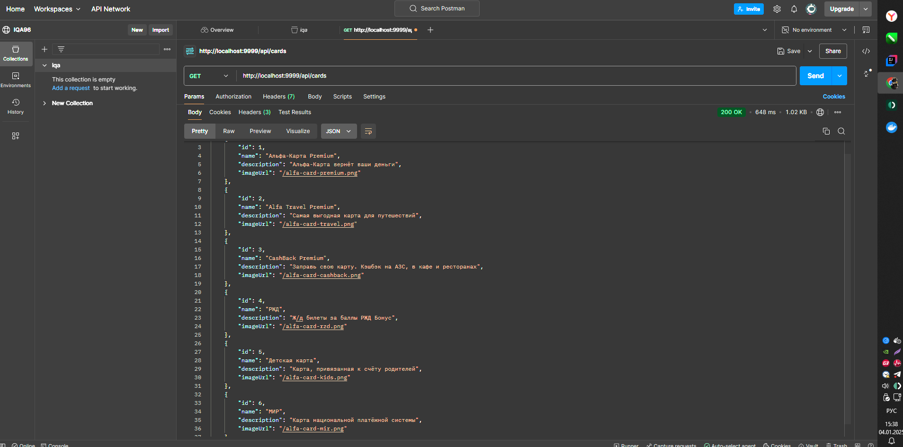

# Докеризация приложения db-api-for-docker

## Описание
Приложение запускается в контейнере, используя Java 8. Оно поднимает сервер на порту 9999.

## Установка и запуск

### Сборка Docker-образа
```bash
docker image build -t db-api:1.0 .

## Скриншот
